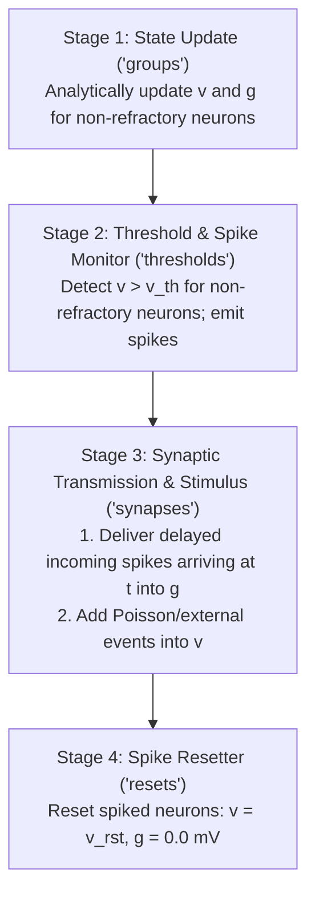

# Scientific Model Semantics: Brian2 to Rust Port

This document specifies the exact biophysical equations, discrete-time scheduling order, refractory logic, delay handling, and Poisson stimulation semantics implemented in Rust (`flysim`) to ensure identical numerical behavior with the reference Brian2 model from Shiu et al. (Nature 2024).

---

## 1. Biophysical Model & Equations

The computational Drosophila brain model implements a Leaky Integrate-and-Fire (LIF) neuron with exponential synaptic conductance decay (alpha-like current dynamic).

### State Variables
For each neuron $k \in \{0, \dots, N-1\}$ where $N = 127,400$:
- $v_k$: Membrane potential (Volts). Initialized to $v_0 = -52\text{ mV}$.
- $g_k$: Synaptic conductance variable (Volts). Initialized to $0\text{ mV}$.
- $t_{\text{last\_spike}, k}$: Timestep of most recent action potential. Initialized to $-\infty$.
- $t_{\text{rfc}, k}$: Refractory duration. Default $2.2\text{ ms}$ ($22$ ticks). Set to $0.0\text{ ms}$ ($0$ ticks) for Poisson stimulation targets.

### Differential Equations
$$\frac{dv_k}{dt} = \frac{v_0 - v_k + g_k}{t_{mbr}} \quad (\text{unless refractory})$$
$$\frac{dg_k}{dt} = -\frac{g_k}{\tau} \quad (\text{unless refractory})$$

### Constants
| Parameter | Symbol | Value | Unit | Definition |
|---|---|---|---|---|
| Resting potential | $v_0$ | $-52.0$ | $\text{mV}$ | Baseline membrane resting voltage |
| Reset potential | $v_{rst}$ | $-52.0$ | $\text{mV}$ | Voltage after spike emission |
| Threshold potential | $v_{th}$ | $-45.0$ | $\text{mV}$ | Spike detection threshold |
| Membrane time constant | $t_{mbr}$ | $20.0$ | $\text{ms}$ | Membrane capacitance $\times$ resistance |
| Synaptic time constant | $\tau$ | $5.0$ | $\text{ms}$ | Synaptic decay timescale |
| Refractory period | $t_{rfc}$ | $2.2$ | $\text{ms}$ | Post-spike inactive interval |
| Synaptic delay | $t_{dly}$ | $1.8$ | $\text{ms}$ | Axonal transmission delay |
| Synapse unit weight | $w_{syn}$ | $0.275$ | $\text{mV}$ | Elementary synaptic scaling |
| Poisson scale | $f_{poi}$ | $250.0$ | unitless | Multiplier for external stimulus step |
| Integration step | $dt$ | $0.1$ | $\text{ms}$ | Discrete timestep ($100\ \mu\text{s}$) |

---

## 2. Analytical Discrete-Time Solution

Because the system of differential equations is linear, Brian2 (`method='linear'`) computes the exact analytical integration across timestep $dt$:

When neuron $k$ is **not refractory**:
$$c_g = e^{-dt / \tau} = e^{-0.1 / 5.0} = e^{-0.02} \approx 0.9801986733067553$$
$$c_v = e^{-dt / t_{mbr}} = e^{-0.1 / 20.0} = e^{-0.005} \approx 0.9950124791926823$$
$$c_{vg} = \frac{\tau}{t_{mbr} - \tau} \left( e^{-dt / \tau} - e^{-dt / t_{mbr}} \right) \times (-1) = \frac{\tau}{t_{mbr} - \tau} \left( c_v - c_g \right)$$
With $\tau = 5\text{ ms}$, $t_{mbr} = 20\text{ ms}$, $t_{mbr} - \tau = 15\text{ ms}$:
$$c_{vg} = \frac{5}{15} (0.9950124791926823 - 0.9801986733067553) = \frac{1}{3} \times 0.0148138058859270 \approx 0.0049379352953090$$

Therefore, in each non-refractory tick:
$$g_k(t + dt) = g_k(t) \cdot c_g$$
$$v_k(t + dt) = v_0 + (v_k(t) - v_0) \cdot c_v + g_k(t) \cdot c_{vg}$$

When neuron $k$ is **refractory**:
$$g_k(t + dt) = g_k(t)$$
$$v_k(t + dt) = v_k(t)$$

---

## 3. Discrete Timestep Schedule (Brian2 vs Rust `flysim`)

Brian2 schedules operations using named slots:
`['start', 'groups', 'thresholds', 'synapses', 'resets', 'end']`.

In Rust `flysim`, every discrete tick $t$ follows this exact execution sequence:



### Detailed Order within Tick $t$:

1. **State Update (`neurongroup_stateupdater`, order 0 in `groups`)**:
   - Condition: `timestep(t - last_spike, dt) >= timestep(rfc, dt)`.
   - If true: apply analytical transition equations to update $g$ and $v$.
   - If false: $g$ and $v$ remain unchanged.

2. **Threshold Detection (`neurongroup_spike_thresholder`, order 0 in `thresholds`)**:
   - Condition: `not_refractory` AND $v_k > v_{th}$.
   - If met:
     - Mark neuron $k$ as spiked at tick $t$.
     - Record spike event $(k, t)$.
     - Set $t_{\text{last\_spike}, k} = t$.
     - Queue synaptic transmissions to all postsynaptic targets $j$ with arrival at tick $t + \text{delay\_ticks}$ (where $\text{delay\_ticks} = \text{round}(t_{dly} / dt) = 18$).

3. **Synaptic & External Input Delivery (`synapses`, order -1 & 0)**:
   - Delayed synaptic delivery (`default_synapses_pre`, order -1):
     For each target neuron $j$ receiving delayed spikes arriving at tick $t$:
     $$g_j \leftarrow g_j + \sum w_{ij}$$
     *(Notice: this addition occurs regardless of whether neuron $j$ is currently refractory!)*
   - External Poisson stimulation (`poissoninput`, order 0):
     For each stimulated neuron $i$ receiving $k$ Poisson events at tick $t$:
     $$v_i \leftarrow v_i + k \cdot (w_{syn} \cdot f_{poi})$$
     *(With $w_{syn} = 0.275\text{ mV}$ and $f_{poi} = 250$, jump magnitude is $68.75\text{ mV}$.)*

4. **Spike Reset (`neurongroup_spike_resetter`, order 0 in `resets`)**:
   - For all neurons that fired in Stage 2 of this tick:
     $$v_k \leftarrow v_{rst} \quad (-52.0\text{ mV})$$
     $$g_k \leftarrow 0.0\text{ mV}$$

---

## 4. Silencing Semantics

In `model.py`, silencing is executed as:
```python
for i in slnc:
    syn.w[' {} == i'.format(i)] = 0*mV
```
In Rust `flysim`:
- When building or running the network for Condition B (or single silencing):
- For all presynaptic indices $i \in \text{silenced\_neurons}$, the outgoing synaptic weights are set to $0.0$, or skipped entirely during event propagation.
- Neuron $i$ itself remains capable of receiving incoming inputs and firing spikes, but its spikes produce no postsynaptic impact.
- Incoming synapses to neuron $i$ remain intact.
